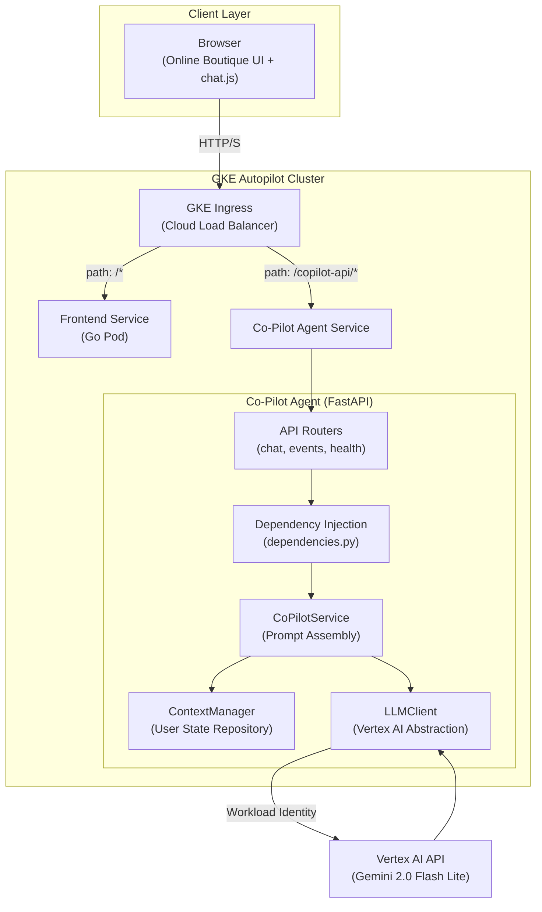

# Boutique Co-Pilot

A proactive, multimodal AI shopping assistant for e-commerce platforms. Built as an independent microservice on Google Kubernetes Engine (GKE) Autopilot, powered by Vertex AI Gemini for real-time, context-aware product recommendations and conversational commerce.

## Architecture



## Design Patterns

* **Dependency Injection** -- FastAPI's `Depends` mechanism wires service instances into route handlers, enabling clean test isolation via `dependency_overrides`.
* **Abstract Base Class (Strategy)** -- `LLMClient` ABC decouples business logic from the Vertex AI SDK, enabling provider swaps and mock-based testing.
* **Repository Pattern** -- `ContextManager` encapsulates per-user state persistence, abstracting the storage backend (in-memory, Redis, Memorystore).
* **Application Factory** -- `create_app()` constructs the ASGI application with middleware and router registration, following 12-factor app principles.

## Project Structure

```
co-pilot-agent/
    app/
        __init__.py
        main.py              # FastAPI application factory
        config.py            # Pydantic Settings (env-driven)
        dependencies.py      # DI container (singleton LLM, context manager)
        models/
            __init__.py
            schemas.py       # Pydantic request/response DTOs
        routers/
            __init__.py
            chat.py          # POST /copilot-api/chat
            events.py        # POST /copilot-api/event
            health.py        # GET /
        services/
            __init__.py
            copilot.py       # CoPilotService (prompt orchestration)
            context.py       # ContextManager (user state repository)
            llm.py           # LLMClient ABC + VertexAIClient
    tests/
        __init__.py
        conftest.py          # Shared fixtures with mocked LLM
        test_chat.py
        test_events.py
    Dockerfile               # Multi-stage, non-root
    requirements.txt
    requirements-dev.txt
```

## Key Features

* **Multimodal Vision**: The assistant analyzes product images via Vertex AI Gemini, answering questions about visual attributes (color, style, pattern) directly from image content.
* **Full Page Awareness**: Contextual scraping of product pages (name, price, description) and homepage (featured products list).
* **Cart Awareness**: Real-time cart state integration including items, quantities, shipping, and totals.
* **Conversational Memory**: Multi-turn dialogue via `sessionStorage`-backed conversation history.
* **Non-Intrusive Integration**: Deployed as an independent microservice without modifying any of the 10 original Online Boutique backend services.

## Environment Variables

| Variable          | Required | Default                  | Description                           |
|-------------------|----------|--------------------------|---------------------------------------|
| `GCP_PROJECT`     | Yes      |                          | Google Cloud project ID               |
| `GCP_REGION`      | No       | `us-central1`            | Vertex AI region                      |
| `MODEL_NAME`      | No       | `gemini-2.0-flash-lite`  | Generative model identifier           |
| `ALLOWED_ORIGINS` | No       | `*`                      | Comma-separated CORS origins          |
| `LOG_LEVEL`       | No       | `INFO`                   | Application log level                 |

## Build and Run

**Docker:**

```sh
cd co-pilot-agent
docker build -t co-pilot-agent .
docker run -p 8080:8080 \
    -e GCP_PROJECT=your-project-id \
    -e GCP_REGION=us-central1 \
    co-pilot-agent
```

**Local Development:**

```sh
cd co-pilot-agent
pip install -r requirements.txt -r requirements-dev.txt
uvicorn app.main:app --reload --port 8080
```

**Testing:**

```sh
cd co-pilot-agent
pytest tests/ -v
ruff check app/ tests/
```

## Technology Stack

* **Orchestration:** GKE Autopilot
* **AI Engine:** Vertex AI (Gemini 2.0 Flash Lite)
* **Backend:** Python 3.12, FastAPI, Pydantic 2.x
* **Authentication:** GKE Workload Identity
* **CI:** GitHub Actions (ruff + pytest)
* **Containerization:** Docker (multi-stage, non-root)
* **Frontend:** Vanilla JavaScript, jQuery, HTML5, CSS3
